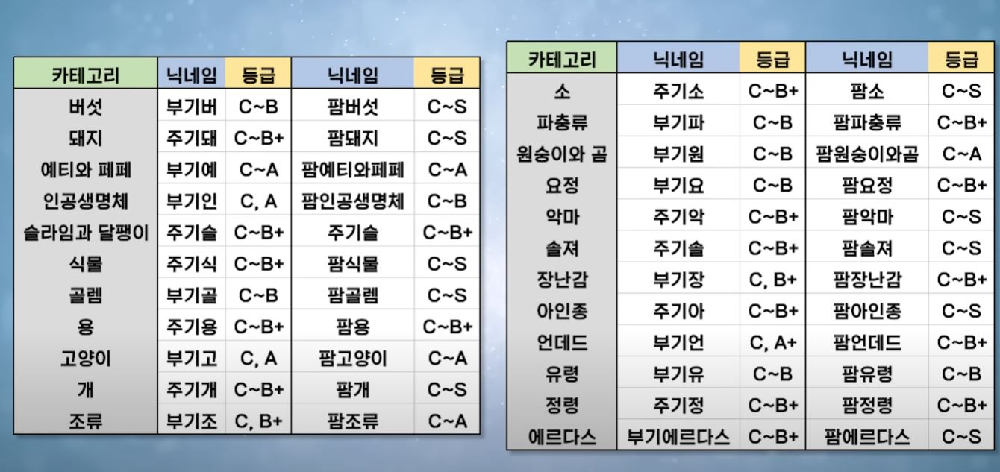

# 1. Header -> \#
# \# This is header 1.
###### \###### This is header 6.

# 2. Horizontal Line -> \---
---

# 3. Text Style.
- Line Break -> Enter x2.
- *italic -> \**, **bold -> \****, ~~cancle~~ -> ~~
- Block Quotes. -> \>
- >B1
- >>B2
- >>>B3
- >>>>B4
- Unordered List -> \-
    - .
1. Ordered List 
    1. 1
- [ ] Checked List.
- [x] This is done!

# 4. Image.
                    <!-- markdown ver. -->
[This is Google Link!](http://www.google.com)

<a href="https://www.naver.com">                         <!-- hyperlink & fixed size. -->
    
</a>

# 5. Anchor.
[4. Image.](#4-Image)

# 6. Inline Code.
~~~python
print('hello!!')
~~~

# 7. Table.
헤더1|헤더2|헤더3
:---|:---:|---:
Left|Center|Right
1|2|3
4|5|6
7|8|9
